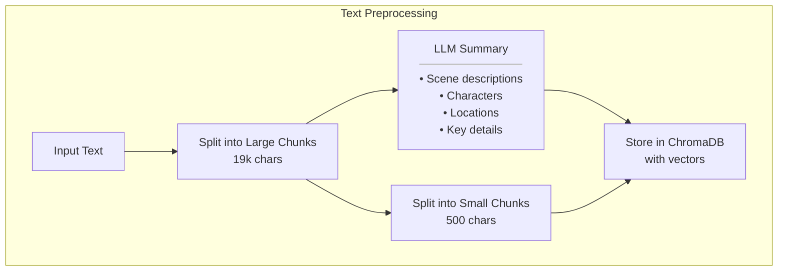

# BookRAG: Intelligent Book Interaction Application

## 🚀 Project Overview

BookRAG is an intelligent application that allows users to interact with book content using advanced RAG (Retrieval-Augmented Generation) techniques.

## 📋 Prerequisites

Before you begin, ensure you have the following installed:
- Python 3.10+
- pip
- venv

## 🛠️ Installation

### 1. Clone the Repository

```bash
git clone https://github.com/WpythonW/bookRAG.git
cd bookRAG
```

### 2. Create and Activate Virtual Environment

```bash
# Create virtual environment
python -m venv venv

# Activate virtual environment
# On Windows
venv\Scripts\activate
# On macOS/Linux
source venv/bin/activate
```

### 3. Install Dependencies

```bash
pip install -r requirements.txt
```

### 4. Configure Environment Variables

Create a `.env` file in the project root and fill in the following details:

```
PROXY_HOST=your_proxy_host
PROXY_PORT=your_proxy_port
PROXY_USER=your_proxy_username
PROXY_PASSWORD=your_proxy_password
GEMINI_API_KEY=your_gemini_api_key
```

## 🚀 Running the Application

```bash
streamlit run app.py
```

## 🔄 How It Works

### Preprocessing algorithm

### Preprocessing algorithm
```mermaid
flowchart TD
    %% User Input and Initial Context
    A[User Query] --> B["Query Vectorization<br><hr>SentenceTransformer<br>'nomic-ai/nomic-embed-text-v1.5'"]
    
    Z["Complete Story Context<br><hr>ALL Scene Summaries"] --> H

    %% Scene Search
    B --> C["Scene Collection Search<br><hr>Input:<br>• Query vector<br>• n_results=2<br><hr>Output:<br>• Two most relevant scenes"]

    %% Chunk Search for Each Scene
    C --> D{"For Each Scene<br>(2 scenes)"}
    D --> |"Scene 1"| E1["Local Chunk Search<br><hr>Input:<br>• Query vector<br>• Parent chunk filter<br>• n_results=2"]
    D --> |"Scene 2"| E2["Local Chunk Search<br><hr>Input:<br>• Query vector<br>• Parent chunk filter<br>• n_results=2"]

    %% Global Search
    B --> F["Global Chunk Search<br><hr>Input:<br>• Query vector<br>• n_results=2<br>• No parent filter"]

    %% Results Processing
    E1 & E2 & F --> G["Results Processing<br><hr>• Remove duplicates<br>• Sort by text order<br>• Format metadata"]

    %% Prompt Generation
    G --> H["Prompt Assembly<br><hr>Components:<br>1. ALL scene summaries (context)<br>2. Search results with:<br>  - 2 relevant scenes<br>  - 2 chunks per scene<br>  - 2 global chunks<br>3. Usage instructions<br>4. User query"]
    
    %% LLM Processing
    H --> I["LLM Input Processing<br><hr>Template sections:<br>1. Scene summaries (context)<br>2. Retrieved relevant excerpts<br>3. Search instructions<br>4. User question"]
    
    I --> J["Gemini LLM<br>Response Generation"]

    %% Styling nodes with dark background and white text
    classDef searchOp fill:#2C3E50,stroke:#34495E,color:white
    class C,E1,E2,F,G,H searchOp

    %% LLM operations with red border
    style I stroke:#f66,stroke-width:2px
    style J stroke:#f66,stroke-width:2px
    
    %% Context style
    style Z fill:#2C3E50,stroke:#34495E,color:white
